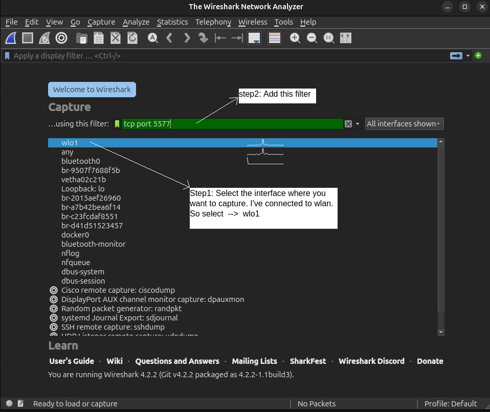
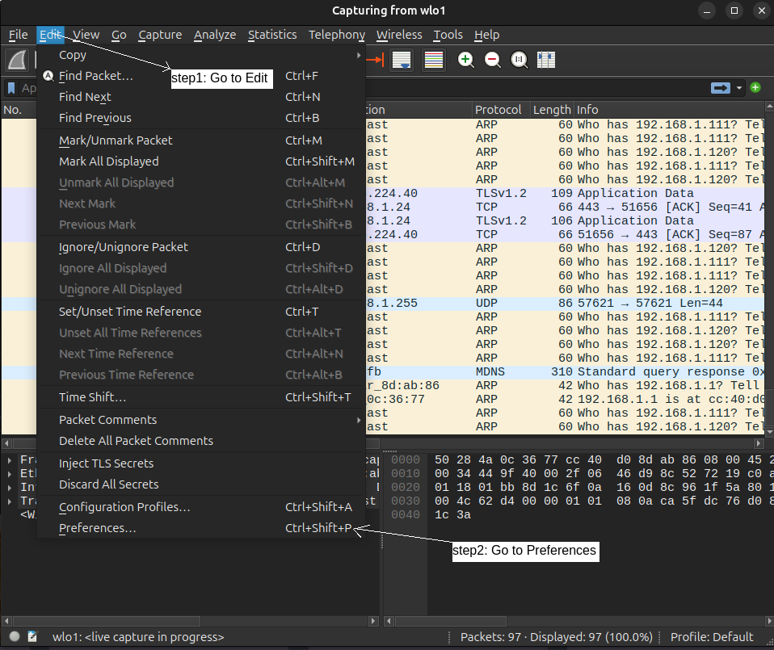
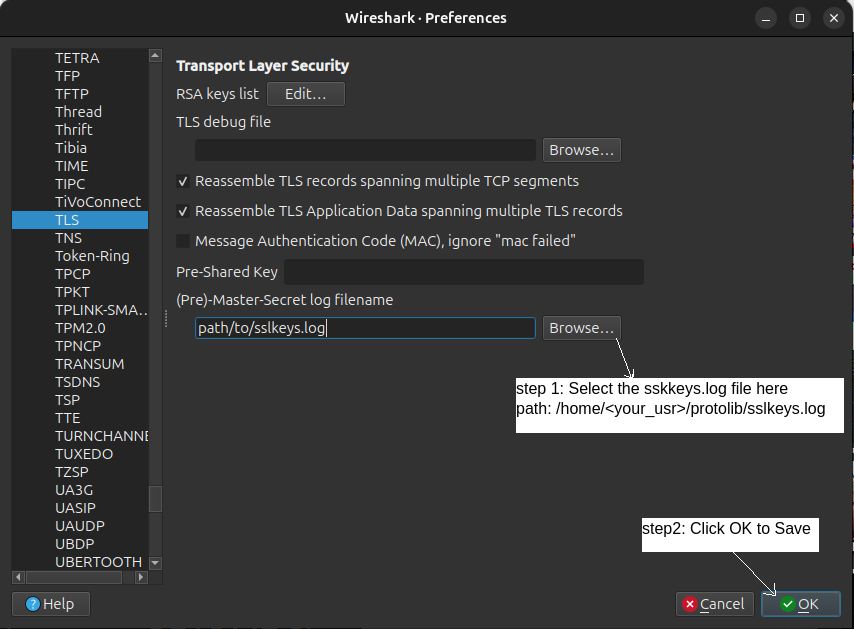
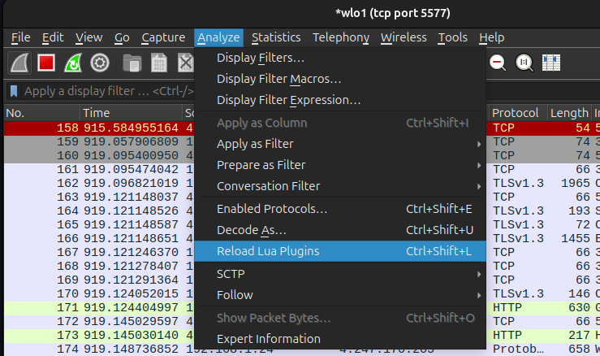
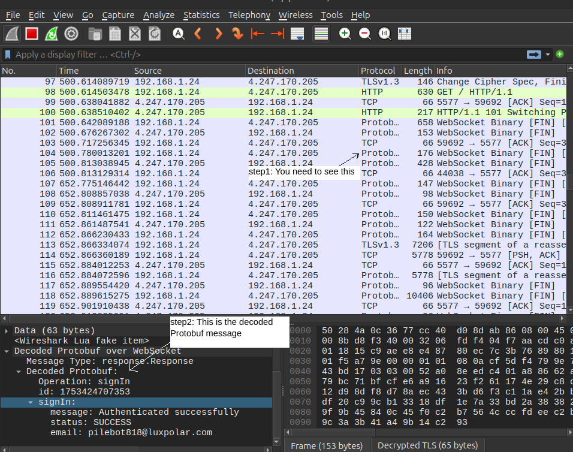

# ws-dcode
Decode websocket with protobuf in wireshark

# Prerequisites

The below are the required in your system:
- `Firefox or Chrome`
- `Git`
- `Wireshark`
- `LuaRocks` (Lua package manager)
- `lua-cjson & lua-protobuf` (Lua modules)

# Install Dependencies
Install all the required prerequisites

### step1: Install Wireshark (GUI + CLI)
- `sudo apt update && sudo apt upgrade -y`

- `sudo apt install -y wireshark`

- `sudo usermod -aG wireshark $USER` (Optional)Allow non-root users to capture packets

### step2: Install Firefox

- `sudo apt install -y firefox`

### step3: Install Lua and LuaRocks (Lua package manager)

Install the dependency modules manually

#### step3.1: Install cjson

    sudo apt install -y build-essential lua5.2 liblua5.2-dev make gcc
    mkdir ~/protolib
    cd ~/protolib
    wget https://github.com/mpx/lua-cjson/archive/refs/tags/2.1.0.tar.gz
    tar -xvzf 2.1.0.tar.gz
    cd lua-cjson-2.1.0
    make LUA_INCLUDE_DIR=/usr/include/lua5.2 LUA_VERSION=5.2
    sudo mkdir -p /usr/lib/x86_64-linux-gnu/lua/5.2
    sudo cp cjson.so /usr/lib/x86_64-linux-gnu/lua/5.2/

#### step3.2: Install pb ( lua-protobuf )

    cd ~/protolib
    git clone https://github.com/starwing/lua-protobuf.git
    cd lua-protobuf
    cmake -DLUA_INCLUDE_DIR=/usr/include/lua5.2 -DCMAKE_C_FLAGS="-I/usr/include/lua5.2"
    make
    sudo cp ./pb.so /usr/lib/x86_64-linux-gnu/lua/5.2/

#### step4: Get Lua websocket decoder plugin

    cd ~/protolib
    git clone https://github.com/Induzio/ws-dcode.git

# Wireshark setup

### step1: open a New terminal

Run wireshark with below cmd:

    sudo wireshark

Now, select wlo1 and in filter 

After selecting step1 and step2 then press Enter... (You'll get an interface capturing on your interface and port 5577)

### step2: open another terminal

The below commands will capture the ssl keys for decryption

##### warning: Before running the below cmds please close all the firefox windows opened

    export SSLKEYLOGFILE=$HOME/protolib/sslkeys.log
    firefox &

Then visit:
         https://ysafe.io
    
once verify if the sslkeys.log is present after visiting by running below cmd in any terminal....
    
    ls $HOME/protolib/sslkeys.log

### step3: Add sslkeys.log in wireshark

Now you have to add the `sslkeys.log` in  `Edit > Preferences > Protocols > TLS`

Follow below steps to add:

#### step3.1: Go to Preferences

    

#### step3.2: Go to protocols

then set (Pre)-Master-Secret log filename:

### step4: Add Protobuf decoding plugin in wireshark

Now run below cmd in any terminal to add the plugin....

    sudo cp ~/protolib/ws-dcode/proto_dissector.lua /usr/lib/x86_64-linux-gnu/wireshark/plugins
    sudo cp ~/protolib/ws-dcode/proto_bundle.desc /usr/lib/x86_64-linux-gnu/wireshark/plugins

Now, reload the lua plugin in wireshark:

#### 🥹 Now your wireshark is setup completely....

### step5: Refresh the firefox to see the decoded protobuf packets

When you refresh again then you'll see the decoded packets in the wireshark as protobuf like below:

#### Hurray 🌟!!!  Now your wireshark is setup to decode the packets to protobuf....
