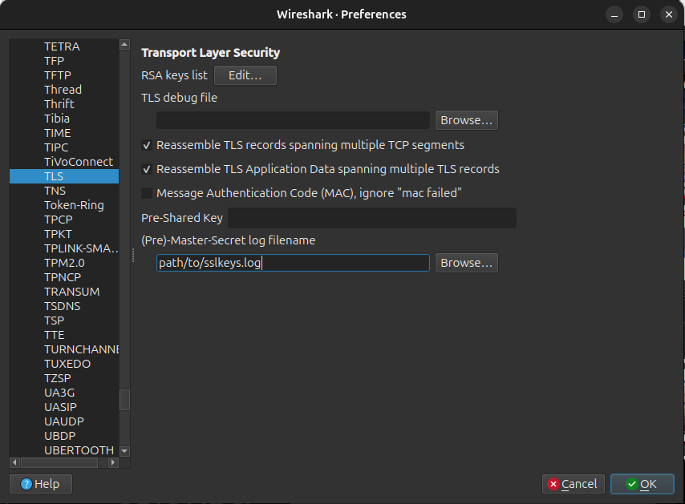

# ws-dcode
Decode websocket with protobuf in wireshark

# Prerequisites

The below are the required in your system:
- `Firefox or Chrome`
- `Wireshark`
- `LuaRocks` (Lua package manager)
- `lua-cjson & lua-protobuf` (Lua modules)

# Install Dependencies
Install all the required prerequisites

### step1: Install Wireshark (GUI + CLI)
- `sudo apt update && sudo apt upgrade -y`

- `sudo apt install -y wireshark`

- `sudo usermod -aG wireshark $USER` (Optional)Allow non-root users to capture packets

### step2: Install Firefox

- `sudo apt install -y firefox`

### step3: Install Lua and LuaRocks (Lua package manager)
    sudo apt install -y lua5.2 luarocks
    sudo luarocks install lua-cjson
    sudo luarocks install lua-protobuf

If the above step3 didn't worked then do step3.1 and step3.2

#### step3.1: Install cjson

    sudo apt install -y build-essential lua5.2 liblua5.2-dev make gcc
    mkdir ~/protolib
    cd ~/protolib
    wget https://github.com/mpx/lua-cjson/archive/refs/tags/2.1.0.10.tar.gz
    tar -xvzf 2.1.0.10.tar.gz
    cd lua-cjson-2.1.0.10
    make LUA_INCLUDE_DIR=/usr/include/lua5.2 LUA_VERSION=5.2
    sudo cp cjson.so /usr/local/lib/lua/5.2/cjson.so

#### step3.2: Install pb ( lua-protobuf )

    cd ..
    git clone https://github.com/starwing/lua-protobuf.git
    cd lua-protobuf
    make LUA_VERSION=5.2 LUA_INCLUDE_DIR=/usr/include/lua5.2
    sudo cp ./build/pb.so /usr/local/lib/lua/5.2/pb.so
    cd ..

#### step4: Get Lua websocket decoder plugin

    git clone https://github.com/Induzio/ws-dcode.git

# Wireshark setup

### step1: open a terminal

The below command will open wireshark GUI

    sudo wireshark

### step2: open another terminal

The below commands will capture the ssl keys for decryption

    export SSLKEYLOGFILE=$HOME/protolib/sslkeys.log
    firefox &

Then visit:
         https://ysafe.io
    
once verify if the sslkeys.log is present after visiting....

### step3: Add proto_dissector.lua in wireshark

Go to:

    Edit > Preferences > Protocols > TLS  

then set (Pre)-Master-Secret log filename:

